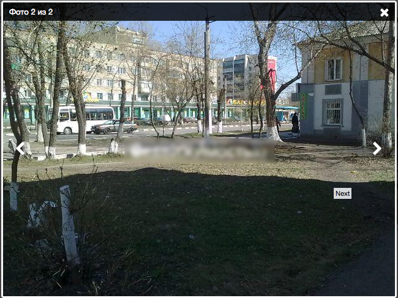

# yii-fancybox-widget
Виджет Fancybox для Yii 1.x

Виджет использует последнюю на данный момент версию [Fancybox](http://fancyapps.com/fancybox/) v.2.1.5 и предназначен для более гибкого "навешивания"  фэнсибокса на нужные элементы DOM. 

Примеры использования:

Страница с комментариями, где под каждым есть ссылка для ответа (например ее класс .answer), чтобы не подключать фэнсибокс для каждой и не настраивать его параметры, подключим так (одновременно скроем саму форму комментария с id=comment-form, если она тут же на странице):

```php
$this->widget('application.extensions.fancybox.AlFancybox', [
        'targetDOM' => '.answer',
        'asDialog' => true,
        'hideDOM'  => '#comment-form',
    ]
);
```


Стандартное использование: любому элементу задаем класс .fancied, и он будет открывать изображения в виде галлереи (тут для примера подключает хелпер Thumbnails самого фэнсибокса и массив с настройками)

```php
$this->widget('application.extensions.fancybox.AlFancybox', [
        'targetDOM' => 'a.fancied',
        'helperThumbs' => true,
        'config' => [...]
    ]
);
```



Подключать виджет вы можете на любых нужных вам страницах, с разными настройками, все ресурсы (стили, скрипты) будут подключены в любом случае, только один раз.

Виджет использует вместо стандартных изображений кнопок фэнсибокса, векторные иконки шрифта [Awesome font] (http://fontawesome.io/), поэтому необходимо подключить его (если не желаете использовать Awesome font, в assets/jquery.fancybox.* раскоментируйте код, который использует изображения, а закомментируйте использующий иконки)

## Подключение
Подключите Awesome font
```html
<link rel="stylesheet" href="https://maxcdn.bootstrapcdn.com/font-awesome/4.4.0/css/font-awesome.min.css">
```

Скопируйте папку **fancybox** в нужную вам директорию. Например в protected/extensions, тогда подключение виджета на любой, необходимой странице будет выглядеть так:

```php
$this->widget('application.extensions.fancybox.AlFancybox', [
        'targetDOM' => '.answer',
        'asDialog' => true,
        'hideDOM'  => '#comment-form',
    ]
);
```

## Параметры виджета
* **id** - Идентификатор виджета. По умолчанию генерируется автоматически
* **targetDOM** - DOM элемент(ы), к которым будем применяться фэнсибокс. По умолчанию: *a.fancied*
* **hideDOM** - DOM элемент(ы), которые необходимо скрыть. По умолчанию: нет
* **asDialog** - Открывать в фэнсибоксе только содержимое окна (Набор предустановленных параметров фэнсибокса, убирающих рамку и кнопки листания, полезно для диалоговых окон). По умолчанию: *false*
* **helperButton** - Подключить ресурсы для плагина Button. По умолчанию: *false*
* **helperThumbs** - Подключить ресурсы для плагина Thumbnails. По умолчанию: *false*
* **helperMedia** - Подключить ресурсы для плагина Media. По умолчанию: *false*
* **config** - Массив с настройками для самого фэнсибокса. Подробное описание параметров и настроек плагинов на сайте [Fancybox](http://fancyapps.com/fancybox/)
